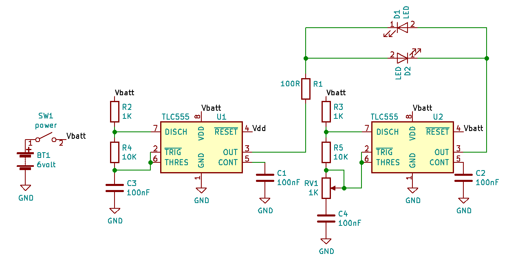
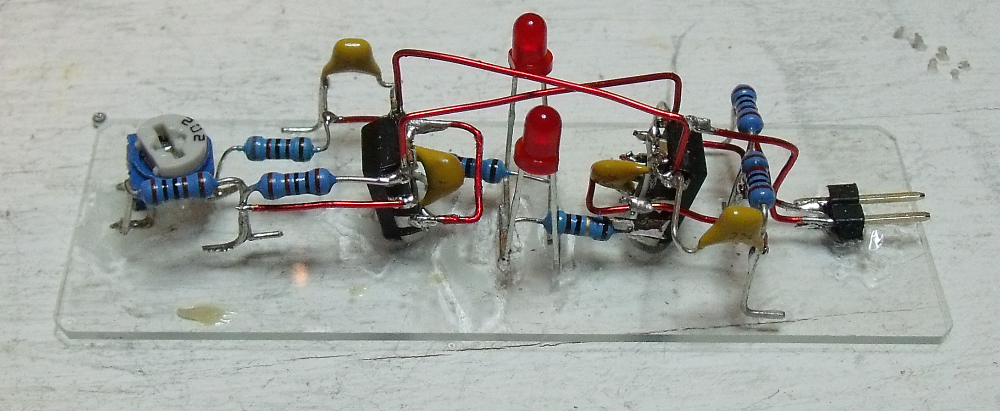
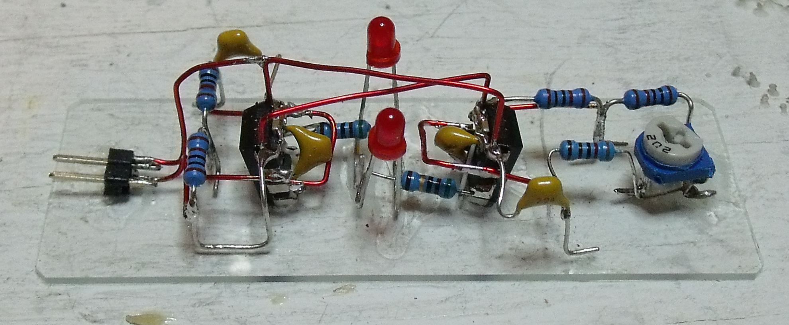
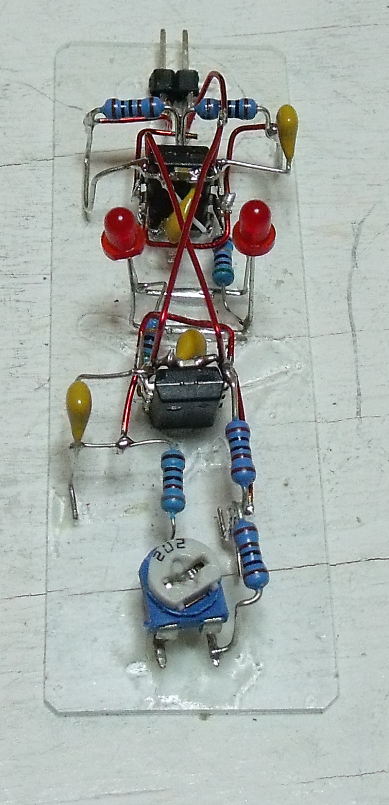
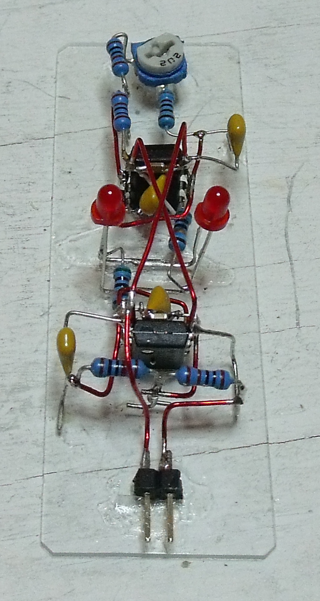

555 fading LED
==============

This circuit produce a fading LED effect using 2 TLC555 timers.  The pulsing rate is controlled by RV1.
The pulsing frequency result from the phase slipping between the two oscillators. 

**Fled=|Fosc1-Fosc2|**

where

* **Fled** is LED fading frequency
* **Fosc1** is frequency of U1
* **Fosc2** is frequency of U2

The two LEDs are in anti-phase, meaning when one is at maximum brigthness the other is at minimum.

sculpture
---------

Made a sculpture on a microscope slide.

link
-----

[video](https://youtu.be/me4tGUi5gXE)

