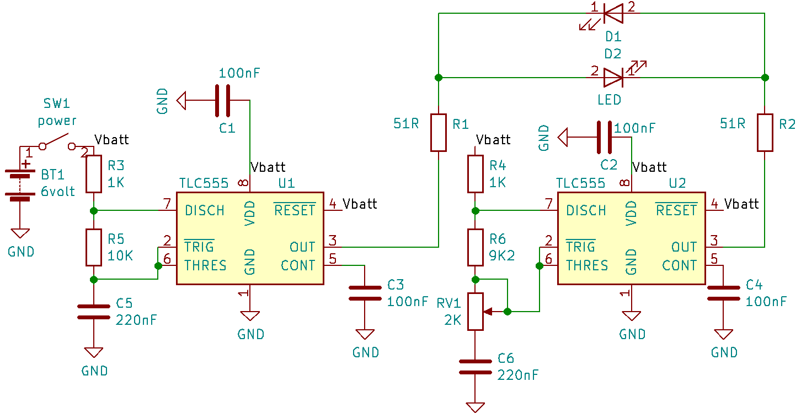

555 fading LED
==============

This circuit produce a fading LED effect using 2 TLC555 timers.  The pulsing rate is controlled by RV1.
The pulsing frequency result from the phase slipping between the two oscillators. 
Ffd=|Fosc1-Fosc2|

